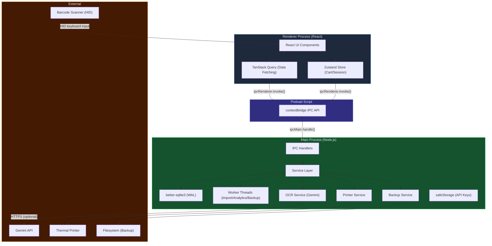
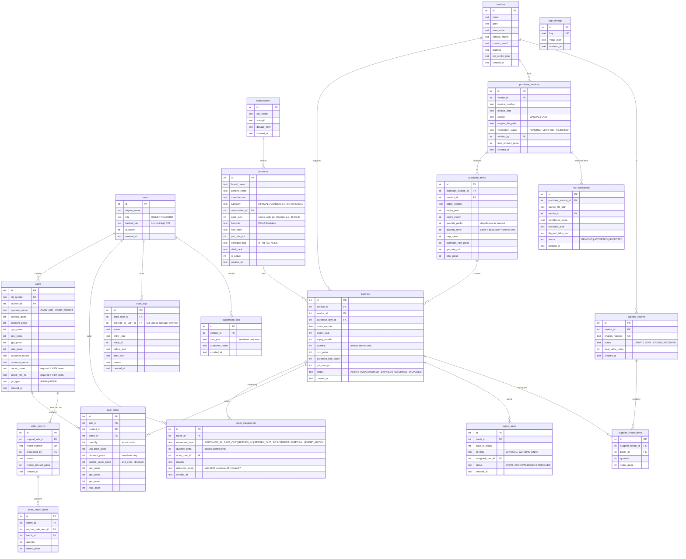

# MedStore POS V1 — Implementation Plan

Build a Windows-first, offline pharmacy Point-of-Sale and inventory management system. The product solves three core business problems: **fast billing**, **batch/expiry loss prevention**, and **reliable purchase stock entry** (manual forms + AI OCR). This is a greenfield build in `d:\Projects\medical`.

---

## User Review Required

> [!IMPORTANT]
> **Gemini API Key management** — The plan stores the Gemini API key in Electron's `safeStorage`-encrypted local config, never in source code or renderer. Confirm this is acceptable, or if you prefer a different secret-storage mechanism (e.g., Windows Credential Vault).

> [!IMPORTANT]
> **GST compliance** — Tax logic implements CGST/SGST (intra-state) and IGST (inter-state) based on store state vs. vendor/customer state. **GST is calculated after item-level discount** (Taxable Value = Unit Price − Discount). Final tax rules must be verified with a qualified CA before production go-live. The system is a calculation aid, not a certified GST filing tool.

> [!WARNING]
> **No cloud sync in V1** — All data lives in a local SQLite file. Backup targets are local folder / USB / secondary drive. Cloud-sync is deferred post-V1.

> [!WARNING]
> **Single-store scope** — V1 targets a single Indian retail medical store. Multi-branch, multi-terminal concurrency, and patient prescription modules are out of scope.

> [!IMPORTANT]
> **Schedule H1/X compliance** — When any cart item has schedule flag `H1` or `X`, the POS checkout will require mandatory doctor name and registration number before allowing bill completion. This follows Indian Drugs and Cosmetics Rules.

---

## Design Decisions (Resolved Questions)

These questions from the initial plan have been resolved based on domain feedback:

| Question | Decision | Rationale |
|---|---|---|
| **Thermal printer model** | Build for generic **ESC/POS** with dynamic **58mm / 80mm** width toggle in Settings. Use `escpos` library. | Covers 95% of Indian TVS/Epson/generic Chinese printers. 80mm is standard for pharmacies (fits GST detail); smaller shops use 58mm. |
| **Barcode format** | Assume **EAN-13** for branded drugs. Many generic/surgical items have **no barcode**. | Keyboard-first FTS5 search handles unscanned items. Barcode is optional in product schema. |
| **User count & login** | **4-digit numeric PIN** login (ATM/iPad POS style). No usernames or passwords. ~5 staff + 1 owner sharing one PC. | Cashiers swap terminals constantly — 1-second login is critical UX. PIN hashed with bcrypt for security. |
| **GST filing integration** | **Internal reports only** in V1. Owner's CA reads "Monthly GST Summary" screen. | Tally/ClearTax CSV export is a V2 paid upsell. |
| **Initial catalog size** | Assume **10,000–15,000 products** for CSV import. | Requires chunked insertion with `worker_threads` and progress UI. |
| **Discount policy** | **Item-level discounts only**. No bill-level discounts in V1. | Bill-level discounts create mathematical nightmares for GST reverse-calculation and partial sales returns. Item-level keeps GST per line item clean. |

---

## Core Architecture

### Technology Stack

| Layer | Technology | Rationale |
|---|---|---|
| Shell | **Electron 33+** | Windows desktop, offline-first, hardware access (printer, scanner) |
| Bundler | **Vite 6** | Fast HMR, native ESM, Electron plugin ecosystem |
| UI | **React 19 + TypeScript 5.7** | Component model, type safety, ecosystem |
| Styling | **Tailwind CSS 4 + shadcn/ui** | Rapid, consistent UI; accessible primitives |
| Database | **better-sqlite3** via Electron main process | Synchronous, zero-config, WAL mode, single-file backup |
| State | **Zustand** (cart, UI session) + **TanStack Query** (paginated data) | Minimal boilerplate, cache/pagination built-in |
| Search | **SQLite FTS5** for products; **Fuse.js** for OCR fuzzy matching | FTS5 is fast and offline; Fuse.js handles messy OCR strings |
| Printing | **escpos** library + Electron `BrowserWindow.print()` PDF fallback | Generic ESC/POS for 95% of Indian thermal printers + universal fallback |
| AI OCR | **Gemini 2.5 Flash** (default), Gemini 2.5 Pro (difficult invoices) | Cost-effective structured extraction; Pro for edge cases |
| Testing | **Vitest** (unit/DB) + **Playwright** (E2E) | Fast, Vite-native, Electron E2E support |
| Packaging | **electron-builder** → NSIS `.exe` installer | Standard Windows distribution |

### Architecture Diagram



### Security & Role Model

#### Roles

| Role | Capabilities | Restrictions |
|---|---|---|
| **OWNER** | Everything: edit inventory, accept OCR purchases, view profit dashboards, delete/void bills, change settings, create/manage users, override expired stock with audit entry | None — full admin |
| **CASHIER** | Search products, create sales bills, view expiry alert dashboard (to know what to pull from shelf), process sales returns (with owner override for deletion) | Cannot: delete/void bills, view purchase rates or profit data, edit inventory counts manually, access user management, override expired/quarantined stock |

#### Manager Override Pattern

Privileged actions by cashiers trigger a **"Manager Override Required"** modal:
1. Cashier clicks restricted action (e.g., "Delete Bill", "Override Batch").
2. Popup appears: *"Manager Override Required — Enter Owner PIN"*.
3. Owner walks over, enters their 4-digit PIN.
4. Main process verifies PIN belongs to an `OWNER` role user.
5. Action executes with audit log: `actor = cashier`, `override_by = owner`, `reason = required`.

#### Other Security Controls

- **`nodeIntegration: false`** — Renderer has zero Node.js access.
- **`contextIsolation: true`** — Strict preload bridge via `contextBridge.exposeInMainWorld()`.
- **Allowlisted IPC channels** — Every channel is explicitly registered; no wildcard handlers.
- **No API keys in renderer** — Gemini key stored in `safeStorage`, accessed only by main-process OCR service.
- **Role-based IPC gating** — Main process validates caller's session role before executing privileged operations.

### Currency, Stock & Tax Rules

- **All money stored as integer paise** (₹1.00 = 100 paise). No floating-point arithmetic on money.
- **Stock tracked per-batch in atomic units (individual pills/tablets/capsules)** via `batches.quantity` column, updated exclusively through `stock_movements` ledger entries.
- **Pack size multiplier** — `products.pack_size` defines how many atomic units per strip/box (e.g., 15 for a strip of 15 tablets). When purchasing 10 strips, `purchase_items.quantity = 10` but `batches` and `stock_movements` record `150` atomic units.
- **FEFO (First Expiry, First Out)** — POS auto-selects the batch with the earliest expiry among `ACTIVE` batches.
- **Expired / Quarantined batches** blocked at the service/query layer — `WHERE status = 'ACTIVE'` on all sale-facing queries, not just UI filtering.
- **Discount before GST** — `Taxable Value = Unit Price − Item Discount`. GST is calculated on the post-discount taxable value. Item-level discounts only (no bill-level discounts in V1).
- **GST split** — Intra-state: CGST + SGST (half each). Inter-state: full IGST. Determined by store state vs. customer state.

---

## Data Model

### Entity-Relationship Diagram



### Critical Data Integrity Rules

| # | Rule | Enforcement |
|---|---|---|
| 1 | **Money as paise** | All `*_paise` columns are `INTEGER NOT NULL`, application-layer `Paise` branded type |
| 2 | **Inventory in atomic units** | `batches.quantity` and `stock_movements.quantity_delta` always in individual pills/tablets. `products.pack_size` defines the multiplier. Purchase entry converts packs → units. |
| 3 | **FEFO batch selection** | Service query: `WHERE status = 'ACTIVE' ORDER BY expiry_year, expiry_month LIMIT 1` |
| 4 | **Expired/quarantined block** | All sale-facing queries filter `status = 'ACTIVE'`; service layer rejects any attempt to add non-active batch to cart |
| 5 | **Sale atomicity** | Single `db.transaction()` wrapping: INSERT sale → INSERT sale_items → UPDATE batch quantities → INSERT stock_movements |
| 6 | **Discount before GST** | `taxable_value_paise = unit_price_paise - discount_paise`. GST calculated on `taxable_value_paise`, never on pre-discount price. |
| 7 | **Schedule H1/X doctor requirement** | If any `sale_items` product has `schedule_flag IN ('H1', 'X')`, `sales.doctor_name` and `sales.doctor_reg_no` must be non-null. Enforced at service layer. |
| 8 | **Duplicate invoice prevention** | UNIQUE constraint on `(vendor_id, invoice_number)` in `purchase_invoices`; owner override inserts audit log with reason |
| 9 | **Generic substitution** | Match on `composition_id` (which encodes salt + strength + dosage form), never on composition name alone |
| 10 | **Stock ledger** | `batches.quantity` is the running balance; every change must have a corresponding `stock_movements` row |
| 11 | **Audit trail** | All inventory edits, price overrides, deletions, returns, and owner overrides create `audit_logs` entries with actor + override_by |
| 12 | **Manager override audit** | When a cashier action requires owner PIN, `audit_logs.actor_user_id = cashier`, `audit_logs.override_by_user_id = owner` |

---

## Project Structure

```
d:\Projects\medical\
├── package.json
├── tsconfig.json
├── tsconfig.node.json
├── vite.config.ts
├── electron-builder.yml
├── tailwind.config.ts
├── .env.example                    # Template only, never committed with real keys
├── src/
│   ├── main/                       # Electron main process
│   │   ├── index.ts                # App entry, window creation
│   │   ├── ipc/                    # IPC handler registrations
│   │   │   ├── index.ts
│   │   │   ├── products.ipc.ts
│   │   │   ├── batches.ipc.ts
│   │   │   ├── sales.ipc.ts
│   │   │   ├── purchases.ipc.ts
│   │   │   ├── users.ipc.ts
│   │   │   ├── vendors.ipc.ts
│   │   │   ├── reports.ipc.ts
│   │   │   ├── ocr.ipc.ts
│   │   │   ├── settings.ipc.ts
│   │   │   └── backup.ipc.ts
│   │   ├── services/               # Business logic (main process only)
│   │   │   ├── db.service.ts       # SQLite init, WAL, migration runner
│   │   │   ├── product.service.ts
│   │   │   ├── batch.service.ts
│   │   │   ├── sale.service.ts
│   │   │   ├── purchase.service.ts
│   │   │   ├── user.service.ts
│   │   │   ├── vendor.service.ts
│   │   │   ├── expiry.service.ts
│   │   │   ├── ocr.service.ts
│   │   │   ├── printer.service.ts
│   │   │   ├── backup.service.ts
│   │   │   ├── audit.service.ts
│   │   │   ├── report.service.ts
│   │   │   └── import.service.ts
│   │   ├── workers/                # Node.js worker_threads
│   │   │   ├── import.worker.ts    # CSV import (10-15k rows)
│   │   │   ├── analytics.worker.ts # Heavy GROUP BY reports
│   │   │   └── backup.worker.ts    # VACUUM INTO backup
│   │   ├── db/
│   │   │   ├── migrations/         # Versioned SQL files
│   │   │   │   ├── 001_initial_schema.sql
│   │   │   │   ├── 002_fts5_products.sql
│   │   │   │   └── ...
│   │   │   └── seeds/              # Dev/test seed data
│   │   │       └── dev-seed.sql
│   │   └── utils/
│   │       ├── paise.ts            # Branded paise type + conversion
│   │       ├── gst.ts              # GST split calculation (post-discount)
│   │       └── pack-size.ts        # Pack → atomic unit conversion
│   ├── preload/
│   │   └── index.ts                # contextBridge IPC API
│   ├── renderer/                   # React application
│   │   ├── index.html
│   │   ├── main.tsx
│   │   ├── App.tsx
│   │   ├── router.tsx
│   │   ├── styles/
│   │   │   └── globals.css
│   │   ├── components/
│   │   │   ├── ui/                 # shadcn/ui primitives
│   │   │   ├── layout/
│   │   │   │   ├── Sidebar.tsx
│   │   │   │   ├── Header.tsx
│   │   │   │   └── AppShell.tsx
│   │   │   ├── auth/
│   │   │   │   ├── PinPad.tsx          # ATM-style numpad component
│   │   │   │   └── ManagerOverride.tsx # Owner PIN popup for restricted actions
│   │   │   ├── pos/
│   │   │   │   ├── ProductSearch.tsx
│   │   │   │   ├── Cart.tsx
│   │   │   │   ├── CartItem.tsx
│   │   │   │   ├── PaymentPanel.tsx
│   │   │   │   ├── BillSummary.tsx
│   │   │   │   ├── BarcodeListener.tsx
│   │   │   │   ├── DoctorDetailsModal.tsx  # H1/X schedule compliance
│   │   │   │   └── SuspendedBillsBadge.tsx # Flashing (N) badge
│   │   │   ├── inventory/
│   │   │   │   ├── ProductForm.tsx
│   │   │   │   ├── ProductList.tsx
│   │   │   │   ├── BatchList.tsx
│   │   │   │   └── ExpiryDashboard.tsx
│   │   │   ├── purchase/
│   │   │   │   ├── PurchaseForm.tsx
│   │   │   │   ├── PurchaseList.tsx
│   │   │   │   ├── OcrUpload.tsx
│   │   │   │   └── OcrVerificationGrid.tsx
│   │   │   ├── reports/
│   │   │   │   ├── DailySummary.tsx
│   │   │   │   ├── ExpiryReport.tsx
│   │   │   │   └── ProfitAnalysis.tsx
│   │   │   └── common/
│   │   │       ├── DataTable.tsx
│   │   │       ├── SearchInput.tsx
│   │   │       ├── ConfirmDialog.tsx
│   │   │       └── LoadingSpinner.tsx
│   │   ├── pages/
│   │   │   ├── LoginPage.tsx       # Full-screen numpad PIN login
│   │   │   ├── PosPage.tsx
│   │   │   ├── DashboardPage.tsx
│   │   │   ├── ProductsPage.tsx
│   │   │   ├── InventoryPage.tsx
│   │   │   ├── PurchasesPage.tsx
│   │   │   ├── VendorsPage.tsx
│   │   │   ├── ReportsPage.tsx
│   │   │   ├── UsersPage.tsx       # OWNER only
│   │   │   ├── SettingsPage.tsx    # OWNER only
│   │   │   └── BackupPage.tsx      # OWNER only
│   │   ├── stores/
│   │   │   ├── cart.store.ts       # Zustand POS cart
│   │   │   ├── auth.store.ts       # Current user session (id, name, role)
│   │   │   └── ui.store.ts         # UI preferences, sidebar state
│   │   ├── hooks/
│   │   │   ├── useProducts.ts      # TanStack Query hooks
│   │   │   ├── useBatches.ts
│   │   │   ├── useSales.ts
│   │   │   ├── useVendors.ts
│   │   │   └── useBarcodeScanner.ts
│   │   ├── lib/
│   │   │   ├── ipc.ts              # Typed IPC client wrapper
│   │   │   ├── formatters.ts       # Paise → ₹ display, date formatting
│   │   │   └── validators.ts       # Zod schemas for forms
│   │   └── types/
│   │       ├── models.ts           # Shared type definitions
│   │       ├── ipc-channels.ts     # Channel name constants + payload types
│   │       └── enums.ts
│   └── shared/                     # Types shared between main & renderer
│       ├── ipc-channels.ts
│       ├── models.ts
│       └── constants.ts
├── tests/
│   ├── unit/
│   │   ├── paise.test.ts
│   │   ├── gst.test.ts
│   │   ├── pack-size.test.ts       # Pack → unit conversion
│   │   ├── fefo.test.ts
│   │   ├── substitution.test.ts
│   │   ├── barcode.test.ts
│   │   └── expiry.test.ts
│   ├── db/
│   │   ├── migration.test.ts
│   │   ├── sale-transaction.test.ts
│   │   ├── stock-movement.test.ts
│   │   ├── duplicate-invoice.test.ts
│   │   └── schedule-h1x.test.ts    # Doctor details enforcement
│   ├── services/
│   │   ├── sale.service.test.ts
│   │   ├── batch.service.test.ts
│   │   ├── purchase.service.test.ts
│   │   └── user.service.test.ts    # PIN auth + role gating
│   └── e2e/
│       ├── pos-flow.test.ts
│       ├── pin-login.test.ts       # PIN login + manager override
│       ├── purchase-flow.test.ts
│       └── backup-restore.test.ts
└── docs/
    ├── DECISIONS.md                 # Immutable architectural decisions log
    └── SCHEMA_CHANGELOG.md          # Migration history and rationale
```

---

## Proposed Changes — Phase-by-Phase

---

### Phase 0: Foundation

> Scaffold the Electron + Vite + React + TypeScript project, configure secure IPC, initialize SQLite with WAL mode, establish the migration runner, and set up worker thread infrastructure.

#### [NEW] Project scaffolding & config files
- `package.json` — Electron, Vite, React, TypeScript, Tailwind, shadcn/ui, better-sqlite3, Zustand, TanStack Query, Vitest, Playwright, electron-builder, bcrypt dependencies.
- `vite.config.ts` — Electron plugin configuration, path aliases.
- `tsconfig.json`, `tsconfig.node.json` — Strict TypeScript config for renderer and main process.
- `electron-builder.yml` — Windows NSIS installer config.
- `tailwind.config.ts` — Theme tokens, shadcn/ui integration.
- `.env.example` — Template with `GEMINI_API_KEY` placeholder.

#### [NEW] [index.ts](file:///d:/Projects/medical/src/main/index.ts)
- Electron app entry point.
- `BrowserWindow` creation with `nodeIntegration: false`, `contextIsolation: true`, preload script path.
- App lifecycle: single instance lock, `ready`, `window-all-closed`, `activate`.

#### [NEW] [preload/index.ts](file:///d:/Projects/medical/src/preload/index.ts)
- `contextBridge.exposeInMainWorld('api', { invoke, on, off })` with typed channel allowlist.
- No Node.js APIs exposed to renderer.

#### [NEW] [db.service.ts](file:///d:/Projects/medical/src/main/services/db.service.ts)
- Initialize `better-sqlite3` with `WAL` journal mode, `synchronous = NORMAL`, `foreign_keys = ON`.
- Migration runner: reads `src/main/db/migrations/*.sql` in version order, tracks applied migrations in `_migrations` table, idempotent re-runs.
- `db.transaction()` wrapper for atomic operations.

#### [NEW] [001_initial_schema.sql](file:///d:/Projects/medical/src/main/db/migrations/001_initial_schema.sql)
- All core tables as defined in the data model section, including:
  - `products.pack_size` (integer, default 1).
  - `sales.doctor_name` and `sales.doctor_reg_no` (nullable text).
  - `sale_items.taxable_value_paise` and `sale_items.discount_paise` (item-level discount).
  - `purchase_items.quantity_packs` and `purchase_items.quantity_units`.
  - `audit_logs.override_by_user_id` (nullable FK for manager override tracking).
  - `suspended_bills` table.
- All constraints, indexes, and unique rules.

#### [NEW] [002_fts5_products.sql](file:///d:/Projects/medical/src/main/db/migrations/002_fts5_products.sql)
- FTS5 virtual table for product search: brand name, generic name, manufacturer, barcode, composition salt name.

#### [NEW] [paise.ts](file:///d:/Projects/medical/src/main/utils/paise.ts)
- Branded `Paise` type (number & `{ __brand: 'paise' }`).
- `toPaise(rupees: number): Paise`, `toRupees(paise: Paise): number`.
- `addPaise(...)`, `subtractPaise(...)` — safe integer arithmetic.

#### [NEW] [gst.ts](file:///d:/Projects/medical/src/main/utils/gst.ts)
- `calculateItemGst(unitPricePaise, discountPaise, gstRatePct, storeState, customerState)` → `{ taxableValue, cgst, sgst, igst }`.
- **Calculation order**: `taxableValue = unitPricePaise - discountPaise` → GST computed on `taxableValue`.
- Intra-state: split evenly into CGST + SGST. Inter-state: full amount as IGST.

#### [NEW] [pack-size.ts](file:///d:/Projects/medical/src/main/utils/pack-size.ts)
- `packsToUnits(packs: number, packSize: number): number` — multiply packs × pack_size for atomic unit conversion.
- `unitsToDisplayQty(units: number, packSize: number): { packs: number, loose: number }` — for display purposes.

#### [NEW] [DECISIONS.md](file:///d:/Projects/medical/docs/DECISIONS.md)
- Initial entries: stack choice, SQLite over PostgreSQL rationale, paise convention, FEFO policy, security model, FTS5 decision, PIN-only auth rationale, item-level-only discounts rationale, atomic unit inventory rationale, post-discount GST rationale.

#### [NEW] Test infrastructure
- `vitest.config.ts` for unit + DB tests.
- `tests/unit/paise.test.ts`, `tests/unit/gst.test.ts`, `tests/unit/pack-size.test.ts` — Foundation unit tests.
- `tests/db/migration.test.ts` — Migration idempotency, foreign key enforcement, WAL mode verification.

**Acceptance criteria:**
- [ ] App opens an empty Electron window.
- [ ] Migrations run idempotently on startup.
- [ ] Dev seed can create/reset a sample database.
- [ ] All Phase 0 tests pass (paise, GST post-discount, pack-size conversion).
- [ ] Preload exposes only allowlisted IPC channels.
- [ ] Worker thread infrastructure can be instantiated (smoke test).

---

### Phase 1: Master Data, Users & Initial Import

> 4-digit PIN authentication, role-based access, CRUD for core entities (users, vendors, compositions, products with pack_size), CSV import via worker thread, and product search.

#### [NEW] [user.service.ts](file:///d:/Projects/medical/src/main/services/user.service.ts)
- Create/update/deactivate users with role `OWNER | CASHIER`.
- **4-digit PIN** hashing with `bcrypt`. PIN verification for login.
- First-run: if no users exist, force owner setup (display name + PIN).
- `verifyOwnerPin(pin)` — used by manager override flow; returns owner user if valid.
- Role validation on every privileged IPC call.

#### [NEW] [users.ipc.ts](file:///d:/Projects/medical/src/main/ipc/users.ipc.ts)
- `users:login` — accepts 4-digit PIN, returns `{ id, display_name, role }` session.
- `users:verify-owner-pin` — for manager override modal; returns success/failure.
- `users:create`, `users:update`, `users:list`, `users:deactivate` — all `OWNER`-gated.

#### [NEW] [PinPad.tsx](file:///d:/Projects/medical/src/renderer/components/auth/PinPad.tsx)
- ATM/iPad-style numpad: large digit buttons (0–9), backspace, enter.
- 4 dot indicators showing entered digit count.
- Wrong PIN: shake animation + "Invalid PIN" message.
- On success: instant transition to POS or Dashboard based on role.

#### [NEW] [ManagerOverride.tsx](file:///d:/Projects/medical/src/renderer/components/auth/ManagerOverride.tsx)
- Reusable modal component: "Manager Override Required".
- Contains `PinPad` component.
- On valid owner PIN: resolves a Promise with `{ ownerId, ownerName }` so calling code can proceed.
- On cancel: rejects the Promise, action is aborted.

#### [NEW] [LoginPage.tsx](file:///d:/Projects/medical/src/renderer/pages/LoginPage.tsx)
- Full-screen, pharmacy-branded login with `PinPad` centered.
- Shows current date/time, store name (from `app_settings`).
- First-run setup flow: create owner account (name + PIN + confirm PIN).
- After login: cashier → POS page; owner → Dashboard page.

#### [NEW] CRUD pages & services
- `vendor.service.ts` + `vendors.ipc.ts` + `VendorsPage.tsx` — Vendor CRUD with GSTIN validation, state code.
- `product.service.ts` + `products.ipc.ts` + `ProductsPage.tsx` — Product CRUD with composition linkage, **pack_size**, barcode (optional, EAN-13), HSN, GST rate, schedule flag, shelf/rack.
- Compositions management UI embedded within products page or as separate section.

#### [NEW] [import.service.ts](file:///d:/Projects/medical/src/main/services/import.service.ts) + [import.worker.ts](file:///d:/Projects/medical/src/main/workers/import.worker.ts)

> [!IMPORTANT]
> **Worker thread required** — CSV import for 10–15k rows runs in a `worker_thread` to avoid blocking the Electron main thread. The worker opens its own `better-sqlite3` connection (read-only is not needed here since it's writing), uses chunked `db.transaction()` batches of ~500 rows, and sends progress messages back via `parentPort.postMessage()`. The main thread relays progress to the renderer over IPC.

- CSV parser: validate required fields, map to products/vendors/batches.
- Pack-size aware: if CSV has "strips" column, multiply by `pack_size` for batch quantity.
- Duplicate detection by barcode or `brand_name + manufacturer + composition`.
- Progress callback: `{ processed, total, errors[] }` sent per chunk.

#### [NEW] Product search
- FTS5 query interface in `product.service.ts`.
- `SearchInput.tsx` — Debounced search, results with composition + stock info + pack_size display.

**Acceptance criteria:**
- [ ] Owner can create account via first-run setup, login with 4-digit PIN.
- [ ] Owner can create cashier accounts; cashier logs in with own PIN.
- [ ] "Billed by: {display_name}" prints on receipts (verified in later phase).
- [ ] Cashier cannot access: inventory edit, user management, settings, profit reports, bill deletion.
- [ ] Manager override modal works: cashier triggers restricted action → owner PIN popup → action proceeds with audit log.
- [ ] Owner can CRUD vendors, products (with pack_size), compositions.
- [ ] CSV import of 15,000 products completes without freezing UI (worker thread).
- [ ] Product search returns results within 50ms for FTS5 queries.

---

### Phase 2: Batch Inventory & Expiry Engine

> Manual purchase invoice entry with pack-size conversion, batch creation with stock movements in atomic units, expiry alerting engine, and supplier return list.

#### [NEW] [purchase.service.ts](file:///d:/Projects/medical/src/main/services/purchase.service.ts)
- Create purchase invoice: validate vendor + invoice number uniqueness (UNIQUE constraint + owner override with audit log via `ManagerOverride`).
- **Pack-size conversion**: `purchase_items.quantity_packs` stores what the user enters (e.g., 10 strips). `purchase_items.quantity_units = quantity_packs × product.pack_size` (e.g., 150 pills). `batches.quantity` increments by `quantity_units`.
- Transaction: INSERT `purchase_invoices` → INSERT `purchase_items` → INSERT/UPDATE `batches` (with `quantity_units`) → INSERT `stock_movements` (type: `PURCHASE_IN`, delta: `quantity_units`).
- Same batch number from same vendor + same product: increment existing batch quantity, don't create duplicate.

#### [NEW] [batch.service.ts](file:///d:/Projects/medical/src/main/services/batch.service.ts)
- Query active batches for product (FEFO ordering).
- All quantities in atomic units; display layer converts to packs/loose using `pack-size.ts`.
- Batch status transitions: `ACTIVE → QUARANTINED → EXPIRED → DISPOSED` or `ACTIVE → RETURNED`.
- Status change creates `stock_movements` entry + `audit_logs` entry.

#### [NEW] [expiry.service.ts](file:///d:/Projects/medical/src/main/services/expiry.service.ts)
- Daily/on-wake job: scan all `ACTIVE` batches, compute days-to-expiry.
- Alert windows: 180, 90, 60, 30, 15, 7, 0 days.
- Auto-mark `EXPIRED` when expiry month/year has passed.
- Auto-mark `QUARANTINED` when within owner-configured near-expiry window.
- Insert/update `expiry_alerts` rows with severity.

#### [NEW] Purchase entry UI
- `PurchaseForm.tsx` — Multi-row invoice entry: vendor, invoice number/date, line items (product search, batch, expiry, **quantity in packs/strips**, MRP, purchase rate, GST). Displays computed atomic units beside the packs field for verification.
- `PurchaseList.tsx` — Paginated list of purchase invoices with filters.

#### [NEW] Expiry dashboard UI
- `ExpiryDashboard.tsx` — Color-coded expiry windows, batch detail drilldown, total value at risk. **Accessible to CASHIER role** (so they know what to pull from shelves).
- Supplier-wise near-expiry return list: grouped by vendor, showing returnable batches, values (OWNER only).

**Acceptance criteria:**
- [ ] Manual purchase entry of "10 strips × 15 pack_size" creates batch with quantity 150.
- [ ] `purchase_items` records both `quantity_packs = 10` and `quantity_units = 150`.
- [ ] Duplicate vendor + invoice number is rejected unless owner overrides with reason (via manager override modal).
- [ ] FEFO returns oldest active batch; expired/quarantined batches excluded from sale queries.
- [ ] Expiry dashboard shows correct values per alert window.
- [ ] Cashier can view expiry dashboard; cashier cannot edit batches or process supplier returns.
- [ ] Supplier return list correctly groups near-expiry batches by vendor.

---

### Phase 3: POS Billing Core

> Full-screen keyboard-first POS with cart, barcode scanning, FEFO batch selection, item-level discounts, post-discount GST calculation, Schedule H1/X doctor details enforcement, suspend/recall with visual badge, sales returns, and atomic sale transactions.

#### [NEW] [sale.service.ts](file:///d:/Projects/medical/src/main/services/sale.service.ts)
- **Schedule H1/X validation**: Before committing, check if any cart item's product has `schedule_flag IN ('H1', 'X')`. If yes, require `doctor_name` and `doctor_reg_no` to be non-empty. Reject sale if missing.
- **Item-level discount & GST**: For each sale item:
  1. `taxable_value_paise = unit_price_paise - discount_paise`
  2. GST calculated on `taxable_value_paise` using `gst.ts`.
  3. `total_paise = taxable_value_paise + cgst + sgst + igst`
- **Atomic sale transaction**: wraps all operations in `db.transaction()`:
  1. Generate sequential bill number.
  2. INSERT `sales` row with totals, tax split, payment mode, cashier_id, doctor details (if applicable).
  3. INSERT `sale_items` rows with per-item discount, taxable value, and tax.
  4. UPDATE `batches` quantity (decrement in atomic units). Fail if insufficient stock.
  5. INSERT `stock_movements` (type: `SALE_OUT`) for each batch.
  6. Return bill data for printing (including "Billed by: {cashier.display_name}").
- **Sales return**: reverse transaction creates `sales_returns` + `sales_return_items` + `stock_movements` (type: `RETURN_IN`) + batch quantity increment. Bill deletion requires manager override.
- **Suspend/recall**: save incomplete cart to `suspended_bills` table (serialized JSON), recall by ID.

#### [NEW] [cart.store.ts](file:///d:/Projects/medical/src/renderer/stores/cart.store.ts)
- Zustand store: items array, add/remove/update quantity, **apply item-level discount**, payment mode, totals computation.
- FEFO batch auto-assignment on item add.
- Owner-only manual batch override (via manager override if cashier attempts).
- `hasScheduleH1X()` computed property — triggers doctor details modal before checkout.

#### [NEW] [DoctorDetailsModal.tsx](file:///d:/Projects/medical/src/renderer/components/pos/DoctorDetailsModal.tsx)
- Triggered automatically when cashier clicks "Pay" and cart contains H1/X scheduled items.
- Fields: Doctor Name (text), Doctor Registration No. (text).
- Cannot proceed without filling both fields.

#### [NEW] [SuspendedBillsBadge.tsx](file:///d:/Projects/medical/src/renderer/components/pos/SuspendedBillsBadge.tsx)
- **Flashing red badge** showing count of suspended bills (e.g., pulsing `(2)`).
- Placed in POS header/toolbar area so cashier never forgets held bills.
- Click opens suspended bills list with recall action.

#### [NEW] [BarcodeListener.tsx](file:///d:/Projects/medical/src/renderer/components/pos/BarcodeListener.tsx)
- Rapid keydown buffering: collect characters within 50ms intervals, trigger on Enter.
- Assumes **EAN-13** format but handles arbitrary-length codes.
- Debounce against manual typing.
- On barcode detected: search product by barcode → auto-add to cart with FEFO batch.

#### [NEW] POS page components
- `PosPage.tsx` — Full-screen layout: left panel (search + product results), center (cart with item discounts), right (totals + payment).
- `ProductSearch.tsx` — FTS5-backed, keyboard-navigable results. Items without barcodes found here.
- `Cart.tsx` + `CartItem.tsx` — Line items with quantity (in atomic units, displayed as packs + loose), batch, price, **item discount**, taxable value, subtotal.
- `PaymentPanel.tsx` — Cash/UPI/Card/Credit selection, amount tendered, change calculation.
- `BillSummary.tsx` — Pre-print preview with GST breakdown (post-discount), "Billed by: {name}".

#### [NEW] GST calculation in sale flow
- Per-item: `taxable_value = unit_price - item_discount` → GST on `taxable_value`.
- Bill-level aggregation of CGST, SGST, IGST for display and receipt.

**Acceptance criteria:**
- [ ] Scan-to-cart latency under 200ms on low-spec machine.
- [ ] Sale transaction fully commits or fully rolls back (test with simulated failures).
- [ ] Insufficient stock prevents sale (not just warning).
- [ ] Item-level discount correctly reduces taxable value before GST calculation.
- [ ] GST on ₹100 item with ₹10 discount is calculated on ₹90, not ₹100.
- [ ] Cart with H1/X scheduled item forces doctor details before checkout.
- [ ] Sale without doctor details for H1/X item is rejected at service layer.
- [ ] Receipt shows "Billed by: Rahul" (cashier's display name).
- [ ] Suspended bills badge shows correct count with pulsing animation.
- [ ] Bill deletion by cashier triggers manager override modal; owner PIN required.
- [ ] Sales return correctly reverses stock and creates audit trail.
- [ ] Suspended bills can be recalled and completed.
- [ ] GST split is correct for intra-state and inter-state scenarios.

---

### Phase 4: Printing & Hardware

> Thermal receipt printing via ESC/POS with 58mm/80mm toggle, A4/PDF fallback, configurable printer settings, cash drawer support.

#### [NEW] [printer.service.ts](file:///d:/Projects/medical/src/main/services/printer.service.ts)
- Thermal printing via `escpos` library (handles 95% of generic Chinese/Indian TVS/Epson printers).
- **Dynamic width**: 58mm or 80mm selectable in settings. Receipt template adapts column layout.
- Receipt template: store name, GSTIN, bill number, date, items (with item discount shown), tax breakdown (post-discount), total, payment mode, "Billed by: {cashier}", return policy.
- A4/PDF fallback using Electron's `BrowserWindow.print()` with hidden window.
- Cash drawer pulse command (configurable).
- Print job queueing and error handling.

#### [NEW] Printer configuration UI
- `SettingsPage.tsx` section: printer selection, **paper width toggle (58mm / 80mm)**, test print, cash drawer enable/disable.
- Print templates for: sale receipt, purchase invoice, supplier return challan, credit note.

**Acceptance criteria:**
- [ ] Thermal receipt prints automatically after successful payment.
- [ ] 58mm and 80mm layouts both render correctly with GST detail.
- [ ] PDF fallback generates correct document when printer is unavailable.
- [ ] Test print works from settings page.
- [ ] Receipt includes: store info, GSTIN, items with item discount, post-discount GST, total, "Billed by: {name}", doctor details (if H1/X sale).

---

### Phase 5: AI Purchase Invoice OCR

> Upload purchase invoice images/PDFs, preprocess, extract structured data via Gemini, match to existing products/vendors with safe fuzzy matching, human verification before stock commit.

#### [NEW] [ocr.service.ts](file:///d:/Projects/medical/src/main/services/ocr.service.ts)
- Image/PDF preprocessing: rotation detection, compression, page splitting for multi-page PDFs.
- Archive original file to configurable path.
- Gemini API call from main process (API key from `safeStorage`):
  - Default: Gemini 2.5 Flash for cost/speed.
  - Fallback: Gemini 2.5 Pro for difficult/low-confidence invoices.
  - Strict JSON schema in system prompt: vendor name, GSTIN, invoice number/date, line items (product name, **pack_size/packing**, batch, expiry, qty in packs, MRP, purchase rate, GST).
  - Response validation with Zod schema.
- **Safe product matching strategy** (ordered priority):
  1. **Barcode exact match** (if present in OCR output).
  2. **Composition_id + manufacturer** match — prioritize pharmacological identity over brand name.
  3. **FTS5 structured match** on brand name + manufacturer.
  4. **Fuse.js fuzzy match** as last resort — with a **high threshold** and mandatory human confirmation for any fuzzy-only match.

> [!WARNING]
> **Drug name safety** — "Omez" and "Emez" have low Levenshtein distance but are entirely different drugs (Omeprazole vs Ondansetron). Fuse.js fuzzy matching must never auto-accept brand name matches without composition context. The matching pipeline always checks `composition_id + manufacturer` before falling back to string similarity.

- Vendor matching: GSTIN exact match → name fuzzy match → new vendor suggestion.
- Vendor-specific OCR profiles: store known column mappings, parsing corrections, product name aliases.
- Confidence scoring per field; flag low-confidence and unmatched fields.
- **Pack-size extraction**: OCR extracts packing info (e.g., "1×15") and maps to product's `pack_size` for auto-conversion to atomic units.

#### [NEW] OCR UI
- `OcrUpload.tsx` — Drag-and-drop or file-picker for image/PDF upload. Progress indicator.
- `OcrVerificationGrid.tsx` — Side-by-side: original invoice image (zoomable) | editable data grid.
  - Color-coded fields: green (high confidence + composition-matched), yellow (fuzzy-matched, needs review), red (unmatched/low-confidence).
  - Product matching suggestions with **composition context shown** and "Create New Product" option for unknown items.
  - Pack-size verification column: OCR-extracted packing vs. product's stored pack_size.
  - "Approve & Import" button → triggers `purchase.service.ts` flow (same as manual entry, with pack-to-unit conversion).

#### [NEW] [ocr_extractions table](file:///d:/Projects/medical/src/main/db/migrations/001_initial_schema.sql)
- Track each extraction attempt: source file, vendor profile used, raw extracted JSON, flagged fields, final status.

**Acceptance criteria:**
- [ ] OCR never changes stock before human verification.
- [ ] Duplicate invoice (same vendor + invoice number) is caught and flagged.
- [ ] Low-confidence fields are visually highlighted for review.
- [ ] Product matching prioritizes composition + manufacturer over brand name string similarity.
- [ ] "Omez" and "Emez" are never auto-matched to each other.
- [ ] Vendor OCR profiles improve matching on subsequent invoices from same vendor.
- [ ] Pack-size from OCR is compared against product's stored pack_size; mismatch is flagged.
- [ ] At least 3 sample invoices per vendor tested in dev.
- [ ] Gemini API key is never exposed to renderer process.

---

### Phase 6: Generic Substitution & Profit Tools

> Show generic alternatives during billing, profit margin analytics, owner/cashier visibility controls.

#### [NEW] Substitution engine in `product.service.ts`
- When product is added to cart, query: `SELECT * FROM products JOIN batches ... WHERE composition_id = ? AND status = 'ACTIVE' AND product_id != ?`.
- Results sorted by margin percentage (descending), showing available stock (in display units: packs + loose).
- Match is **composition_id** (which encodes salt + strength + dosage form), never partial match.

#### [NEW] Substitution UI in POS
- Inline panel in `PosPage.tsx`: when ethical/branded product is searched, show "Generic Alternatives" with price, margin %, available qty.
- **Cashier visibility**: controlled by `app_settings` — owner can hide margin % and purchase rate from cashier role while still allowing substitution prompts (showing only MRP difference).

#### [NEW] Analytics dashboard

> [!IMPORTANT]
> **Worker thread required** — Heavy `GROUP BY` queries for profit analysis and slow-moving stock reports run in `analytics.worker.ts` to avoid blocking the main thread while cashiers are billing.

- `DashboardPage.tsx` — Today's sales, gross profit, expiring stock value, slow-moving stock, supplier returns pending.
- `ProfitAnalysis.tsx` — Product-wise and category-wise margin reports.
- Role-gated: **OWNER only** for profit data, purchase rates, and margin reports.

**Acceptance criteria:**
- [ ] Substitution never suggests wrong strength or dosage form.
- [ ] Owner can see profit impact; cashier cannot see purchase rates or margin data.
- [ ] Dashboard loads within 2 seconds with 10,000+ products (analytics in worker thread).
- [ ] Heavy report queries do not freeze POS billing on the same machine.

---

### Phase 7: Staff Accountability & Compliance Safety

> Audit logging with manager override tracking, expiry task checklists, quarantine/disposal workflows, staff accountability.

#### [NEW] [audit.service.ts](file:///d:/Projects/medical/src/main/services/audit.service.ts)
- Automatic audit logging for: inventory edits, price overrides, invoice deletion, return processing, owner overrides, batch status changes.
- Each entry: `actor_user_id` (who performed), `override_by_user_id` (owner who authorized, if manager override), action, entity type + ID, before/after JSON, reason, timestamp.
- Audit log is append-only; no delete/update operations exposed.
- Cashier actions requiring override: bill deletion, expired stock correction, batch manual adjustment, price override.

#### [NEW] Expiry task management
- Daily expiry task checklist: auto-generated per shelf/zone based on `expiry_alerts`.
- **Cashier can view and acknowledge** tasks (since they pull items from shelves).
- Staff assignment and confirmation tracking.
- Unresolved tasks escalate to dashboard alerts (OWNER dashboard).

#### [NEW] Batch status workflow
- UI for: quarantine (remove from sale, keep in stock), supplier return (generate challan), disposal (zero out with audit), "not for sale" flag.
- Expired stock cannot re-enter sale flow without explicit owner correction + audit entry (via manager override).
- All status transitions require `OWNER` role or manager override.

**Acceptance criteria:**
- [ ] Every stock-changing action has actor, reason, and reference in audit log.
- [ ] Manager override entries show both `actor_user_id` (cashier) and `override_by_user_id` (owner).
- [ ] Expired stock cannot be sold, even through direct IPC manipulation (service-layer block).
- [ ] Staff task completion is tracked; unresolved tasks visible on owner dashboard.

---

### Phase 8: Backup, Restore, Performance & Packaging

> Scheduled local backup via worker thread, restore with integrity check, performance optimization, Windows installer packaging, UAT.

#### [NEW] [backup.service.ts](file:///d:/Projects/medical/src/main/services/backup.service.ts) + [backup.worker.ts](file:///d:/Projects/medical/src/main/workers/backup.worker.ts)

> [!IMPORTANT]
> **Worker thread required** — `VACUUM INTO` for backup runs in `backup.worker.ts` to avoid blocking the main thread. This is especially important since backups may run on a schedule while cashiers are actively billing.

- Scheduled backup: `VACUUM INTO` for consistent snapshot, run in worker thread, target configurable path.
- Manual backup + restore with integrity check (`PRAGMA integrity_check`).
- Backup naming: `medstore_backup_YYYYMMDD_HHmmss.db`.
- Restore flow: verify backup integrity → confirm with owner (OWNER role required) → replace active DB → restart app.
- Corrupted backup detection and rejection.

#### [NEW] Backup UI
- `BackupPage.tsx` — OWNER only. Backup schedule config (frequency, target path/USB), manual backup/restore buttons, backup history list.

#### Performance optimization
- Enforce `LIMIT` + offset pagination on all list queries.
- React virtualization (`@tanstack/react-virtual`) for large lists.
- Profile and enforce: idle RAM < 300MB, search queries < 50ms, scan-to-cart < 200ms.
- No full-table React renders; all data fetching is paginated via TanStack Query.
- **Worker threads** for: CSV import (Phase 1), analytics reports (Phase 6), backup (Phase 8) — main thread stays responsive for POS IPC.
- `better-sqlite3.iterate()` with `setImmediate` yielding for any main-thread query returning 1000+ rows (if worker is not used).

#### [NEW] Packaging
- `electron-builder.yml` — NSIS installer config: app name, icon, install directory, auto-update disabled (V1).
- Build script: `npm run build` → `electron-builder --win`.

**Acceptance criteria:**
- [ ] Backup restores successfully on a fresh Windows machine.
- [ ] Corrupted backup is detected and rejected.
- [ ] Backup runs in worker thread; POS billing is not interrupted during scheduled backup.
- [ ] App remains fully usable offline.
- [ ] Idle RAM < 300MB.
- [ ] CSV import of 15k rows does not freeze UI.
- [ ] Analytics report generation does not freeze POS.
- [ ] NSIS installer works on target Windows PC.
- [ ] UAT completed on actual pharmacy PC with real scanner and printer.

---

## Verification Plan

### Automated Tests

```bash
# Unit tests (paise, GST post-discount, pack-size, FEFO, substitution, barcode, expiry)
npx vitest run tests/unit/

# Database tests (migrations, transactions, stock movements, duplicate prevention, H1/X enforcement)
npx vitest run tests/db/

# Service tests (sale, batch, purchase, user/PIN auth)
npx vitest run tests/services/

# E2E tests (POS flow, PIN login + manager override, purchase flow, backup/restore)
npx playwright test tests/e2e/

# All tests
npx vitest run && npx playwright test
```

### Manual Verification

| Scenario | Method |
|---|---|
| **PIN login UX** | 5 users swap in/out on same PC in under 5 seconds each |
| **Manager override** | Cashier attempts bill delete → owner PIN popup → action proceeds |
| **Pack-size conversion** | Purchase 10 strips of 15-pack → verify batch shows 150 units |
| **Item discount + GST** | ₹100 item, ₹10 discount → verify GST on ₹90 |
| **H1/X compliance** | Add Schedule H1 drug → verify doctor details required before checkout |
| **Thermal printing** | Print test receipt on 58mm and 80mm printers |
| **Barcode scanning** | Scan 20+ EAN-13 products + verify keyboard search for non-barcoded items |
| **OCR drug safety** | Upload invoice with "Omez" → verify it doesn't match "Emez" |
| **Suspended bills** | Hold 3 bills → verify flashing badge shows (3) → recall and complete |
| **Performance** | Profile on target pharmacy PC (Intel i3/i5, 4-8GB RAM); verify CSV import doesn't freeze UI |
| **Offline operation** | Disconnect network, verify all non-OCR features work |
| **Backup/restore** | Backup → fresh Windows install → restore → verify data |
| **Worker threads** | Run backup + analytics while billing simultaneously |

### Test Coverage Targets

| Category | Coverage Target |
|---|---|
| Currency (paise) utilities | 100% |
| GST split calculation (post-discount) | 100% |
| Pack-size conversion | 100% |
| Sale transaction atomicity | 100% (including rollback) |
| FEFO batch selection | 100% |
| Batch status transitions | 100% |
| Schedule H1/X enforcement | 100% |
| Duplicate invoice prevention | 100% |
| PIN auth + role gating | 100% (OWNER × CASHIER × all operations) |
| Manager override flow | 100% |
| OCR → stock flow | 100% (no stock change without verification) |
| Backup integrity | 100% |

---

## Risk Register

| Risk | Impact | Mitigation |
|---|---|---|
| SQLite corruption on power loss | Data loss | WAL mode + `synchronous = NORMAL` + scheduled backups in worker thread |
| **Main thread blocking (better-sqlite3)** | **UI freeze during billing** | **Worker threads for CSV import, analytics, backup. `setImmediate` yielding for large main-thread queries.** |
| OCR misreads critical data (qty, MRP) | Inventory/financial error | Mandatory human verification; low-confidence highlighting |
| **OCR matches wrong drug (e.g., Omez ↔ Emez)** | **Patient safety / inventory error** | **Match by composition_id + manufacturer first; Fuse.js only as fallback with high threshold + human confirmation** |
| Gemini API unavailable | OCR blocked | Manual entry always available; OCR is assistant-only |
| Thermal printer compatibility | Can't print receipts | `escpos` library handles 95% of printers; PDF fallback always available; 58mm/80mm toggle |
| Barcode scanner variance | Missed scans | Configurable scan timeout; keyboard-first FTS5 search always available; many items have no barcode |
| Large catalog performance | Slow UI | FTS5 indexing, pagination, virtualization, query LIMIT enforcement, worker threads |
| Staff bypasses role restrictions | Unauthorized changes | Service-layer enforcement + manager override pattern + audit logging with actor + override_by |
| Tax calculation errors | Legal/financial risk | CA verification before go-live; system is calculation aid only; discount-before-GST explicitly coded |
| **Wrong pack_size → inventory mismatch** | **Stock count errors** | **Display computed atomic units beside packs field for verification; OCR flags pack_size mismatches** |
| **Missing doctor details for H1/X drugs** | **Regulatory non-compliance** | **Service-layer enforcement: sale rejected if H1/X item present without doctor name + reg no** |

---

## Assumptions

1. **Single Indian retail medical store** — no multi-branch, no multi-terminal concurrency.
2. **Windows desktop only** — no macOS, Linux, or mobile targets in V1.
3. **No patient prescription module** in V1.
4. **Internet not required** for POS/inventory — only for AI OCR.
5. **OCR uses Gemini 2.5 Flash** by default; Gemini 2.5 Pro for difficult samples.
6. **Tax rules must be verified** with a qualified local expert before production.
7. **Currency is INR (₹)** — all amounts stored as integer paise.
8. **Barcode scanner operates as HID keyboard device** — no serial/USB driver integration needed.
9. **Two roles only**: `OWNER` (full admin) and `CASHIER` (restricted). No separate `STAFF` role in V1.
10. **4-digit numeric PIN authentication** — no usernames or passwords. ~5 cashiers + 1 owner sharing one PC.
11. **Inventory quantity is always in atomic units** (individual pills/tablets). Pack_size multiplier converts strips/boxes on entry.
12. **Item-level discounts only** — no bill-level discounts in V1.
13. **GST calculated after discount** — Taxable Value = Unit Price − Item Discount.
14. **Schedule H1/X sales require doctor name and registration number** per Indian Drugs and Cosmetics Rules.
15. **Tally/ClearTax export** is deferred to V2 as a paid feature.
