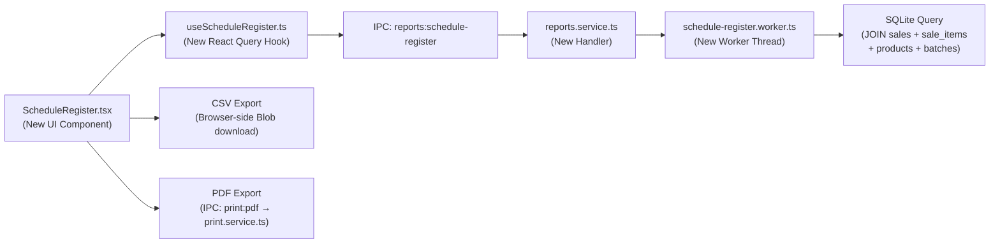

# Schedule H/H1/X Drug Register — Implementation Plan

## Background & Legal Context

Under the **Indian Drugs and Cosmetics Rules (Rule 65)**, every licensed pharmacy must maintain a register of all Schedule H, H1, and X drug sales. Drug inspectors can demand this register at any time during an inspection. Currently, MedStore POS:

- ✅ **Tracks schedule classification** (`H`, `H1`, `X`, `NONE`) on every product ([constants.ts:L22-28](file:///d:/Projects/medical/src/shared/constants.ts#L22-L28))
- ✅ **Enforces doctor details at checkout** — the UI detects scheduled drugs and requires Doctor Name + Registration Number ([CheckoutModal.tsx:L54-55](file:///d:/Projects/medical/src/renderer/components/pos/CheckoutModal.tsx#L54-L55))
- ✅ **Stores doctor info in the `sales` table** (`doctor_name`, `doctor_reg_no` columns — [001_initial_schema.ts:L152-153](file:///d:/Projects/medical/src/main/db/migrations/001_initial_schema.ts#L152-L153))
- ❌ **No dedicated register view or report** to display/export this data for inspectors

> [!IMPORTANT]
> **No schema changes are needed.** All the required data (sale date, patient name, doctor name/reg no, drug brand, batch number, quantity) is already captured in the existing `sales`, `sale_items`, `batches`, and `products` tables. This feature is purely a **query + UI + export** addition.

---

## User Review Required

> [!WARNING]
> **Schedule H validation gap**: The current `DOCTOR_REQUIRED_SCHEDULES` constant in [constants.ts:L31-34](file:///d:/Projects/medical/src/shared/constants.ts#L31-L34) only includes `H1` and `X` — not `H`. However, the actual checkout UI in [CheckoutModal.tsx:L54](file:///d:/Projects/medical/src/renderer/components/pos/CheckoutModal.tsx#L54) checks for `['H', 'H1', 'X']`, so the UI already enforces it correctly. The constant should be updated for consistency, but the real-world behavior is already correct.

> [!IMPORTANT]
> **Inspector column requirements**: The plan below includes the standard columns required under Rule 65. Please confirm if your local inspector expects any additional fields (e.g., prescription number, manufacturer name, or quantity in packs vs units).

---

## Open Questions

1. **Date range default**: Should the register default to showing the current month (most common for inspections), or last 30 days?
2. **Print format preference**: Should the printable register use A4 landscape (fits more columns comfortably) or A4 portrait? Plan assumes **landscape**.

---

## Proposed Changes

### Architecture Overview

The feature follows the same established patterns already in the codebase:



---

### Component 1: Backend — Worker Thread & Service

#### [NEW] [schedule-register.worker.ts](file:///d:/Projects/medical/src/main/workers/schedule-register.worker.ts)

A new worker thread (following the same pattern as [reports.worker.ts](file:///d:/Projects/medical/src/main/workers/reports.worker.ts)) that:

1. Opens a **read-only** SQLite connection to the database
2. Runs the core query (see below) filtering sales by date range and schedule flag
3. Returns both **JSON data** (for the UI table) and **CSV content** (for export)

**Core SQL Query:**
```sql
SELECT
  s.created_at       AS sale_date,
  s.bill_number,
  p.brand_name       AS drug_name,
  p.schedule_flag,
  p.generic_name,
  c.salt_name || ' ' || c.strength || ' ' || c.dosage_form AS composition,
  b.batch_number,
  b.expiry_date,
  si.quantity         AS qty_sold,
  p.pack_size,
  COALESCE(s.customer_name, 'Walk-in')   AS patient_name,
  s.customer_mobile   AS patient_phone,
  COALESCE(s.doctor_name, 'Not Provided')   AS doctor_name,
  COALESCE(s.doctor_reg_no, 'Not Provided') AS doctor_reg_no,
  u.display_name      AS sold_by
FROM sale_items si
JOIN sales s         ON si.sale_id = s.id
JOIN products p      ON si.product_id = p.id
JOIN batches b       ON si.batch_id = b.id
JOIN users u         ON s.cashier_id = u.id
LEFT JOIN compositions c ON p.composition_id = c.id
WHERE p.schedule_flag IN ('H', 'H1', 'X')
  AND s.created_at >= ?   -- start date
  AND s.created_at < ?    -- end date (exclusive)
ORDER BY s.created_at ASC
```

> [!NOTE]
> **NULL handling for Schedule H drugs**: Plain Schedule H drugs (e.g. standard antibiotics like Amoxicillin) don't legally require a doctor's prescription or name in the register the way H1 and X drugs do. This means `doctor_name` and `doctor_reg_no` can legitimately be NULL for those sales. `COALESCE(..., 'Not Provided')` ensures the CSV output looks clean and professional for the inspector instead of showing blank cells. Similarly, `customer_name` defaults to `'Walk-in'` for anonymous counter sales.

**CSV Headers** (matching what Drug Inspectors typically check):
```
S.No, Date, Bill No, Schedule, Drug Name, Composition, Batch No, Expiry, Qty, Patient Name, Patient Phone, Doctor Name, Doctor Reg No, Sold By
```

**Worker receives**: `{ dbPath, startDate, endDate, format: 'json' | 'csv' }`  
**Worker returns**: `{ success: true, data: [...], csvContent: '...' }` or `{ success: false, error: '...' }`

---

#### [MODIFY] [reports.service.ts](file:///d:/Projects/medical/src/main/services/reports.service.ts)

Add a new function `getScheduleRegister(startDate, endDate, format)` that spawns the worker thread and returns the result. Register a new IPC handler for `IPC_CHANNELS.REPORTS_SCHEDULE_REGISTER`.

```diff
+export function getScheduleRegister(startDate: string, endDate: string): Promise<{ data: any[], csvContent: string }> {
+  return new Promise((resolve, reject) => {
+    const dbDir = app.getPath('userData')
+    const dbPath = join(dbDir, 'data', APP_DEFAULTS.DB_FILENAME)
+    const worker = new Worker(scheduleRegisterWorkerPath, {
+      workerData: { dbPath, startDate, endDate }
+    })
+    worker.on('message', (msg) => msg.success ? resolve(msg) : reject(new Error(msg.error)))
+    worker.on('error', reject)
+  })
+}
```

Also add to `registerReportsHandlers()`:
```diff
+  ipcMain.handle(IPC_CHANNELS.REPORTS_SCHEDULE_REGISTER, async (_, startDate: string, endDate: string) => {
+    return await getScheduleRegister(startDate, endDate)
+  })
```

---

### Component 2: Shared — IPC Channel & Constants

#### [MODIFY] [ipc-channels.ts](file:///d:/Projects/medical/src/shared/ipc-channels.ts)

Add one new channel under the Reports section:

```diff
   REPORTS_GSTR1: 'reports:gstr1',
+  REPORTS_SCHEDULE_REGISTER: 'reports:schedule-register',
```

#### [MODIFY] [constants.ts](file:///d:/Projects/medical/src/shared/constants.ts)

Update `DOCTOR_REQUIRED_SCHEDULES` to include `H` for consistency:

```diff
 export const DOCTOR_REQUIRED_SCHEDULES: readonly ScheduleFlag[] = [
+  SCHEDULE_FLAGS.H,
   SCHEDULE_FLAGS.H1,
   SCHEDULE_FLAGS.X
 ]
```

> [!NOTE]
> This constant change has **no behavioral impact** — the checkout UI in `CheckoutModal.tsx` already hardcodes `['H', 'H1', 'X']` at line 54. This just makes the shared constant consistent with actual behavior.

---

### Component 3: Frontend — UI Component

#### [NEW] [ScheduleRegister.tsx](file:///d:/Projects/medical/src/renderer/components/reports/ScheduleRegister.tsx)

A full-page component accessible from the sidebar. Key elements:

**Header Bar:**
- Title: "Schedule H/H1/X Drug Register"
- Subtitle: "As required under Rule 65, Drugs and Cosmetics Rules"
- Date range picker (two `<input type="date">` fields, defaulting to current month)
- Schedule filter dropdown (All / H only / H1 only / X only)
- Three action buttons: **"Load"**, **"Export CSV"**, **"Print / PDF"**

**Data Table:**
| S.No | Date | Bill No | Sch. | Drug Name | Composition | Batch | Expiry | Qty | Patient | Doctor | Reg No | Sold By |
|------|------|---------|------|-----------|-------------|-------|--------|-----|---------|--------|--------|---------|

**Summary Footer:**
- Total entries count
- Breakdown by schedule type (e.g., "H: 42 | H1: 18 | X: 3")

**Empty State:**
- When no data is found for the selected range: "No Schedule H/H1/X drug sales found for this period."

**Export Behavior:**
- **CSV**: Same pattern as GSTR-1 export in [SettingsForm.tsx:L155-164](file:///d:/Projects/medical/src/renderer/components/settings/SettingsForm.tsx#L155-L164) — fetches CSV string from backend, creates a Blob, triggers browser download as `Schedule_Register_YYYY-MM.csv`
- **Print/PDF**: Generates an A4 landscape HTML table with pharmacy header, date range, and all register rows. Uses the existing `PRINT_PDF` IPC channel → [print.service.ts:generatePdf()](file:///d:/Projects/medical/src/main/services/print.service.ts#L208-L247) to create a PDF saved to `Documents/MedStore/Reports/Schedule_Register_YYYY-MM.pdf`, then opens it in the OS default PDF viewer via `shell.openPath()`

---

#### [NEW] [useScheduleRegister.ts](file:///d:/Projects/medical/src/renderer/hooks/useScheduleRegister.ts)

React Query hook following the same pattern as [useSales.ts](file:///d:/Projects/medical/src/renderer/hooks/useSales.ts):

```typescript
export function useScheduleRegister(startDate: string, endDate: string) {
  return useQuery({
    queryKey: ['reports', 'schedule-register', startDate, endDate],
    queryFn: () => window.api.invoke(IPC_CHANNELS.REPORTS_SCHEDULE_REGISTER, startDate, endDate),
    enabled: !!startDate && !!endDate
  })
}
```

---

### Component 4: Navigation Integration

#### [MODIFY] [Layout.tsx](file:///d:/Projects/medical/src/renderer/components/layout/Layout.tsx)

Add a new nav item for the register, placed between "Sales History" and "Staff" (owner-only):

```diff
   { icon: ShoppingBag, label: 'Sales History', role: 'OWNER' },
+  { icon: ClipboardList, label: 'Drug Register', role: 'OWNER' },
   { icon: Users, label: 'Staff', role: 'OWNER' },
```

Import `ClipboardList` from `lucide-react`.

#### [MODIFY] [App.tsx](file:///d:/Projects/medical/src/renderer/App.tsx)

Add the route for the new tab:

```diff
   import { SalesHistory } from './components/sales/SalesHistory'
+  import { ScheduleRegister } from './components/reports/ScheduleRegister'

   {activeTab === 'Sales History' && <SalesHistory />}
+  {activeTab === 'Drug Register' && <ScheduleRegister />}
```

---

## File Summary

| Action | File | Purpose |
|--------|------|---------|
| **NEW** | `src/main/workers/schedule-register.worker.ts` | Worker thread: runs the SQL query on a read-only DB connection, returns JSON + CSV |
| **MODIFY** | `src/main/services/reports.service.ts` | Add `getScheduleRegister()` function + IPC handler |
| **MODIFY** | `src/shared/ipc-channels.ts` | Add `REPORTS_SCHEDULE_REGISTER` channel |
| **MODIFY** | `src/shared/constants.ts` | Add `H` to `DOCTOR_REQUIRED_SCHEDULES` for consistency |
| **NEW** | `src/renderer/components/reports/ScheduleRegister.tsx` | Full-page register view with table, filters, and export buttons |
| **NEW** | `src/renderer/hooks/useScheduleRegister.ts` | React Query hook for fetching register data |
| **MODIFY** | `src/renderer/components/layout/Layout.tsx` | Add "Drug Register" nav item (owner-only) |
| **MODIFY** | `src/renderer/App.tsx` | Wire up the new tab to render `ScheduleRegister` |

---

## Verification Plan

### Automated Tests
```bash
npm run test
```
- Existing unit tests must pass (no regressions)
- No new unit tests needed since this is a read-only query feature with no mutations

### Manual Verification
1. **Data presence**: Create a test sale with a Schedule H1 product (include doctor details). Verify it appears in the Drug Register with all columns populated.
2. **Date filtering**: Change date range and confirm the register updates correctly.
3. **Schedule filtering**: Filter by H-only, H1-only, X-only — verify correct subset appears.
4. **CSV export**: Click "Export CSV", open the file in Excel, verify all columns and data are correct and properly escaped (commas in drug names, etc.).
5. **PDF/Print**: Click "Print / PDF", verify a clean A4 landscape document is generated with the pharmacy header, date range, and complete register table.
6. **Empty state**: Select a date range with no scheduled drug sales. Verify the empty state message appears.
7. **Navigation**: Confirm the "Drug Register" tab appears only for OWNER role, not CASHIER.
8. **Performance**: Test with a large dataset (1000+ sale items) to confirm the worker thread doesn't block the UI.
